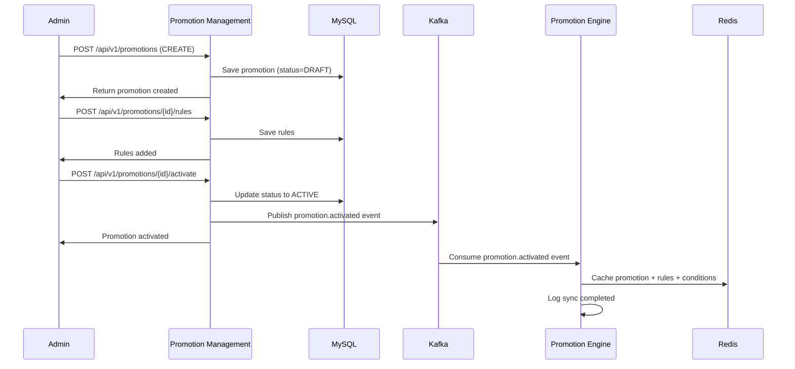
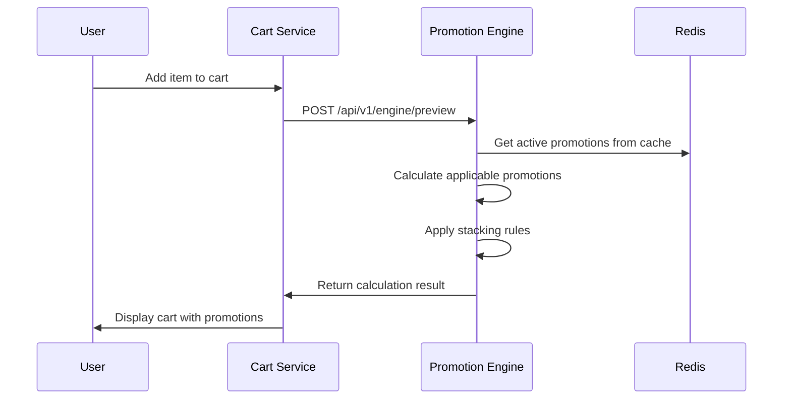
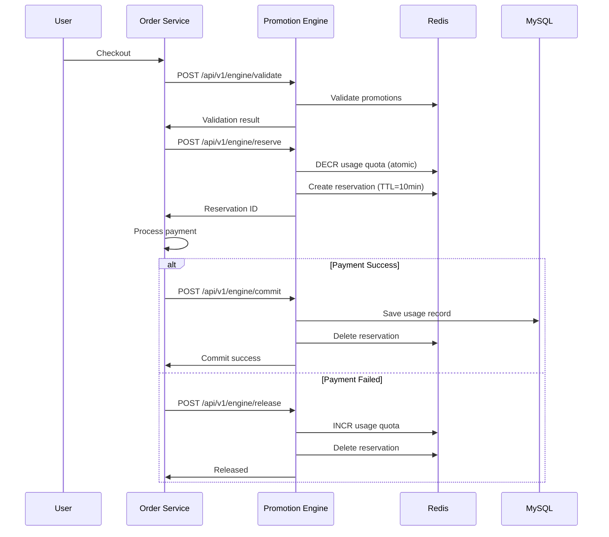
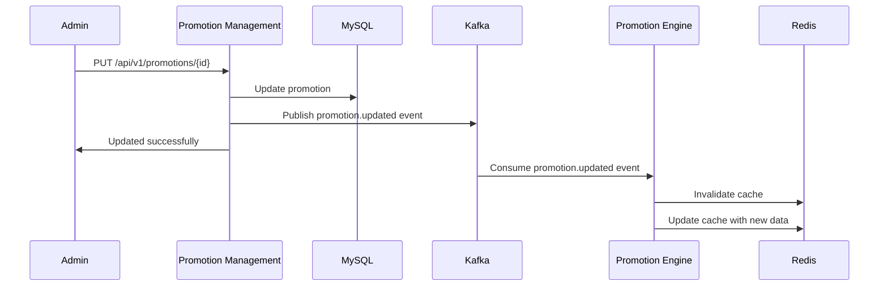

# Service Integration - Promotion Management & Promotion Engine

## Tổng quan Kiến trúc

### Hai Service chính:

```
┌─────────────────────────────────┐         ┌──────────────────────────────┐
│  Promotion Management Service   │         │   Promotion Engine Service   │
│  (Port: 8080)                   │         │   (Port: 8081)              │
├─────────────────────────────────┤         ├──────────────────────────────┤
│ • CRUD Promotions               │◄───────►│ • Calculate Promotions       │
│ • Manage Rules & Conditions     │  Sync   │ • Validate Promotions        │
│ • Lifecycle Management          │         │ • Reserve/Commit Usage       │
│ • Audit Logs                    │         │ • High Performance Cache     │
│ • Admin UI                      │         │ • Real-time Processing       │
└─────────────────────────────────┘         └──────────────────────────────┘
           │                                            ▲
           │                                            │
           ▼                                            │
    ┌─────────────┐                            ┌───────────────┐
    │   MySQL     │                            │  Cart Service │
    │  (Master)   │                            │ Order Service │
    └─────────────┘                            │  POS Service  │
           │                                   └───────────────┘
           ▼
    ┌─────────────┐                     ┌──────────────┐
    │    Redis    │◄───────────────────►│    Redis     │
    │   (Cache)   │      Shared         │  (Counter)   │
    └─────────────┘                     └──────────────┘
           ▲
           │
    ┌──────────────┐
    │    Kafka     │
    │ (Event Bus)  │
    └──────────────┘
```

---

## 1. Communication Patterns

### 1.1 Synchronous Communication (REST API)

**Use cases:**
- Promotion Management → Promotion Engine: Initial sync, manual refresh
- Cart/Order Services → Promotion Engine: Calculate, validate, reserve promotions

**Protocol:** REST API over HTTP/HTTPS

**Authentication:**
```yaml
Service-to-Service:
  Method: API Key + mTLS (mutual TLS)
  Headers:
    X-API-Key: <service_secret_key>
    X-Service-Name: <calling_service_name>
```

---

### 1.2 Asynchronous Communication (Event-Driven)

**Message Broker:** Apache Kafka

**Topics:**

```yaml
promotion.lifecycle.events:
  - promotion.created
  - promotion.updated
  - promotion.activated
  - promotion.disabled
  - promotion.deleted

promotion.rule.events:
  - rule.added
  - rule.updated
  - rule.deleted

promotion.condition.events:
  - condition.added
  - condition.updated
  - condition.deleted

promotion.usage.events:
  - usage.reserved
  - usage.committed
  - usage.released
  - usage.expired
```

**Event Schema Example:**

```json
{
  "eventId": "evt_123456",
  "eventType": "promotion.activated",
  "eventTime": "2024-06-15T10:00:00Z",
  "source": "promotion-management-service",
  "version": "1.0",
  "data": {
    "promotionId": "promo_123",
    "name": "Summer Sale 2024",
    "type": "PERCENTAGE",
    "status": "ACTIVE",
    "startDate": "2024-06-01T00:00:00",
    "endDate": "2024-08-31T23:59:59",
    "rules": [...],
    "conditions": [...],
    "stackingConfig": {...}
  }
}
```

---

## 2. Data Flow Scenarios

### 2.1 Create and Activate Promotion Flow



**Steps:**

1. **Admin tạo promotion DRAFT**
   - Request: `POST /api/v1/promotions`
   - Promotion Management save vào MySQL với status=DRAFT
   - KHÔNG sync sang Engine (vì chưa ACTIVE)

2. **Admin thêm rules và conditions**
   - Request: `POST /api/v1/promotions/{id}/rules`
   - Request: `POST /api/v1/promotions/{id}/conditions`
   - Save vào MySQL, chưa sync

3. **Admin activate promotion**
   - Request: `POST /api/v1/promotions/{id}/activate`
   - Promotion Management:
     - Validate promotion (có đủ rules, thời gian hợp lệ)
     - Update status → ACTIVE
     - Publish event `promotion.activated` to Kafka

4. **Promotion Engine consume event**
   - Listen Kafka topic `promotion.lifecycle.events`
   - Parse event data
   - Load full promotion data (nếu event chỉ có ID)
   - Cache vào Redis:
     ```
     Key: promotion:{promotionId}
     Key: promotion:rules:{promotionId}
     Key: promotion:conditions:{promotionId}
     Key: promotion:stacking:{promotionId}
     ```
   - Set TTL = 5 minutes (auto refresh)

---

### 2.2 Calculate Promotion for Cart Flow



**Steps:**

1. **User thêm sản phẩm vào cart**
   - Cart Service gọi Promotion Engine

2. **Cart Service gọi Preview API**
   ```http
   POST /api/v1/engine/preview
   X-API-Key: cart-service-key
   
   {
     "customerId": "cust_001",
     "channel": "WEB",
     "items": [...]
   }
   ```

3. **Promotion Engine xử lý**
   - Load active promotions từ Redis cache
   - Filter promotions theo conditions:
     - Channel match
     - Customer eligible
     - Product applicable
     - Time valid
   - Calculate discount cho từng promotion
   - Apply stacking rules (priority, exclusive groups)
   - Return kết quả (không reserve quota)

4. **Cart Service nhận response**
   - Update cart total
   - Display promotions applied
   - Show savings to user

**Performance:**
- Target: < 50ms (p95)
- Cache hit rate: > 95%

---

### 2.3 Checkout and Reserve Promotion Flow



**Steps:**

1. **Validate promotions**
   ```http
   POST /api/v1/engine/validate
   {
     "orderId": "order_123",
     "promotionIds": ["promo_123"],
     "items": [...]
   }
   ```
   - Check promotion active
   - Check quota available
   - Check conditions met
   - Return validation result

2. **Reserve promotion quota**
   ```http
   POST /api/v1/engine/reserve
   {
     "orderId": "order_123",
     "promotionIds": ["promo_123"],
     "ttlSeconds": 600
   }
   ```
   
   Promotion Engine xử lý:
   ```python
   # Atomic operation in Redis
   quota_key = f"promotion:{promotion_id}:quota"
   current = redis.get(quota_key)
   if current > 0:
       redis.decr(quota_key)  # Atomic decrement
       reservation_key = f"reservation:{reservation_id}"
       redis.setex(reservation_key, 600, json.dumps(data))
       return {"reserved": True}
   else:
       return {"reserved": False, "reason": "QUOTA_EXCEEDED"}
   ```

3. **Commit hoặc Release**
   
   **Success case:**
   ```http
   POST /api/v1/engine/commit
   {
     "reservationId": "rsv_123"
   }
   ```
   - Save usage record vào MySQL
   - Delete reservation từ Redis
   - Publish event `usage.committed`

   **Failed case:**
   ```http
   POST /api/v1/engine/release
   {
     "reservationId": "rsv_123"
   }
   ```
   - Increment quota counter trong Redis
   - Delete reservation
   - Publish event `usage.released`

---

### 2.4 Update Promotion Flow



**Cache Invalidation Strategy:**

```python
def handle_promotion_updated_event(event):
    promotion_id = event['data']['promotionId']
    
    # Delete old cache
    redis.delete(f"promotion:{promotion_id}")
    redis.delete(f"promotion:rules:{promotion_id}")
    redis.delete(f"promotion:conditions:{promotion_id}")
    
    # Fetch fresh data
    promotion = fetch_promotion_from_management(promotion_id)
    
    # Cache new data
    redis.setex(f"promotion:{promotion_id}", 300, json.dumps(promotion))
    
    # Publish cache updated event
    publish_event("promotion.cache.updated", promotion_id)
```

---

## 3. Data Synchronization

### 3.1 Initial Sync (Startup)

Khi Promotion Engine service khởi động:

```python
@app.on_event("startup")
async def startup_event():
    logger.info("Starting cache warmup...")
    
    # 1. Call Promotion Management API to get all ACTIVE promotions
    response = requests.get(
        "http://promotion-management:8080/api/v1/promotions",
        params={"status": "ACTIVE", "size": 1000},
        headers={"X-API-Key": SERVICE_API_KEY}
    )
    
    promotions = response.json()['data']['content']
    
    # 2. Cache all promotions
    for promotion in promotions:
        cache_promotion(promotion)
    
    # 3. Load usage quotas from MySQL to Redis
    sync_usage_quotas()
    
    logger.info(f"Cache warmup completed: {len(promotions)} promotions loaded")
```

### 3.2 Incremental Sync (Event-driven)

```python
@kafka_consumer.on("promotion.lifecycle.events")
async def handle_promotion_event(event):
    event_type = event['eventType']
    promotion_id = event['data']['promotionId']
    
    handlers = {
        'promotion.created': handle_promotion_created,
        'promotion.updated': handle_promotion_updated,
        'promotion.activated': handle_promotion_activated,
        'promotion.disabled': handle_promotion_disabled,
        'promotion.deleted': handle_promotion_deleted
    }
    
    handler = handlers.get(event_type)
    if handler:
        await handler(event['data'])
```

### 3.3 Periodic Full Sync (Consistency Check)

```python
@scheduler.scheduled(cron="0 */30 * * * *")  # Every 30 minutes
async def periodic_full_sync():
    logger.info("Starting periodic full sync...")
    
    # Get all ACTIVE promotions from Management Service
    remote_promotions = fetch_active_promotions_from_management()
    
    # Get cached promotion IDs
    cached_promotion_ids = redis.smembers("cached_promotion_ids")
    
    # Find differences
    remote_ids = {p['id'] for p in remote_promotions}
    
    # Add missing promotions
    missing = remote_ids - cached_promotion_ids
    for promotion_id in missing:
        promotion = fetch_promotion_detail(promotion_id)
        cache_promotion(promotion)
    
    # Remove stale promotions
    stale = cached_promotion_ids - remote_ids
    for promotion_id in stale:
        invalidate_promotion_cache(promotion_id)
    
    logger.info(f"Full sync completed: +{len(missing)} -{len(stale)}")
```

---

## 4. Database Schema

### 4.1 Promotion Management Service (MySQL)

**Primary data store**

```sql
-- Promotions table
CREATE TABLE promotions (
    id BIGINT PRIMARY KEY AUTO_INCREMENT,
    name VARCHAR(255) NOT NULL,
    description TEXT,
    type VARCHAR(50) NOT NULL,
    status VARCHAR(50) NOT NULL,
    discount_value DECIMAL(10,2),
    max_discount_amount DECIMAL(10,2),
    min_order_value DECIMAL(10,2),
    start_date DATETIME NOT NULL,
    end_date DATETIME NOT NULL,
    usage_limit INT,
    usage_limit_per_customer INT,
    usage_count INT DEFAULT 0,
    created_at DATETIME DEFAULT CURRENT_TIMESTAMP,
    created_by VARCHAR(100),
    updated_at DATETIME DEFAULT CURRENT_TIMESTAMP ON UPDATE CURRENT_TIMESTAMP,
    updated_by VARCHAR(100),
    deleted BOOLEAN DEFAULT FALSE,
    version INT DEFAULT 0,
    INDEX idx_status (status),
    INDEX idx_dates (start_date, end_date),
    INDEX idx_deleted (deleted)
);

-- Rules table
CREATE TABLE promotion_rules (
    id BIGINT PRIMARY KEY AUTO_INCREMENT,
    promotion_id BIGINT NOT NULL,
    type VARCHAR(50) NOT NULL,
    discount_percent DECIMAL(5,2),
    max_discount_amount DECIMAL(10,2),
    discount_amount DECIMAL(10,2),
    min_order_value DECIMAL(10,2),
    buy_product_id VARCHAR(100),
    buy_quantity INT,
    get_product_id VARCHAR(100),
    get_quantity INT,
    max_applications INT,
    applicable_regions JSON,
    applicable_shipping_methods JSON,
    created_at DATETIME DEFAULT CURRENT_TIMESTAMP,
    FOREIGN KEY (promotion_id) REFERENCES promotions(id),
    INDEX idx_promotion (promotion_id)
);

-- Conditions table
CREATE TABLE promotion_conditions (
    id BIGINT PRIMARY KEY AUTO_INCREMENT,
    promotion_id BIGINT NOT NULL,
    condition_type VARCHAR(50) NOT NULL,
    condition_value JSON NOT NULL,
    operator VARCHAR(20),
    created_at DATETIME DEFAULT CURRENT_TIMESTAMP,
    FOREIGN KEY (promotion_id) REFERENCES promotions(id),
    INDEX idx_promotion (promotion_id)
);

-- Stacking rules table
CREATE TABLE promotion_stacking_rules (
    id BIGINT PRIMARY KEY AUTO_INCREMENT,
    promotion_id BIGINT NOT NULL UNIQUE,
    stackable BOOLEAN DEFAULT TRUE,
    priority INT DEFAULT 0,
    exclusive_group_id VARCHAR(100),
    max_stack_discount DECIMAL(10,2),
    FOREIGN KEY (promotion_id) REFERENCES promotions(id)
);

-- Audit logs table
CREATE TABLE audit_logs (
    id BIGINT PRIMARY KEY AUTO_INCREMENT,
    promotion_id BIGINT NOT NULL,
    action VARCHAR(50) NOT NULL,
    user_id VARCHAR(100),
    user_name VARCHAR(255),
    changes JSON,
    created_at DATETIME DEFAULT CURRENT_TIMESTAMP,
    INDEX idx_promotion (promotion_id),
    INDEX idx_created_at (created_at)
);
```

### 4.2 Promotion Engine Service (MySQL)

**Usage tracking and history**

```sql
-- Usage records table
CREATE TABLE promotion_usages (
    id BIGINT PRIMARY KEY AUTO_INCREMENT,
    promotion_id VARCHAR(100) NOT NULL,
    customer_id VARCHAR(100) NOT NULL,
    order_id VARCHAR(100) NOT NULL,
    discount_amount DECIMAL(10,2) NOT NULL,
    original_amount DECIMAL(10,2) NOT NULL,
    final_amount DECIMAL(10,2) NOT NULL,
    channel VARCHAR(50),
    used_at DATETIME DEFAULT CURRENT_TIMESTAMP,
    INDEX idx_promotion (promotion_id),
    INDEX idx_customer (customer_id),
    INDEX idx_order (order_id),
    INDEX idx_used_at (used_at)
);

-- Reservation table (transient, can also use Redis only)
CREATE TABLE promotion_reservations (
    id BIGINT PRIMARY KEY AUTO_INCREMENT,
    reservation_id VARCHAR(100) NOT NULL UNIQUE,
    order_id VARCHAR(100) NOT NULL,
    customer_id VARCHAR(100) NOT NULL,
    promotion_id VARCHAR(100) NOT NULL,
    reserved_at DATETIME DEFAULT CURRENT_TIMESTAMP,
    expires_at DATETIME NOT NULL,
    status VARCHAR(20) DEFAULT 'PENDING',
    INDEX idx_reservation_id (reservation_id),
    INDEX idx_order (order_id),
    INDEX idx_expires_at (expires_at),
    INDEX idx_status (status)
);
```

### 4.3 Redis Cache Schema

**Promotion Engine Service**

```
# Promotion data
Key: promotion:{promotionId}
Type: String (JSON)
TTL: 300 seconds (5 minutes)
Value: {
  "id": "promo_123",
  "name": "Summer Sale",
  "type": "PERCENTAGE",
  "status": "ACTIVE",
  ...
}

# Promotion rules
Key: promotion:rules:{promotionId}
Type: String (JSON Array)
TTL: 300 seconds
Value: [
  {
    "id": "rule_001",
    "type": "PERCENTAGE_DISCOUNT",
    ...
  }
]

# Promotion conditions
Key: promotion:conditions:{promotionId}
Type: String (JSON Array)
TTL: 300 seconds

# Active promotion IDs (for quick lookup)
Key: promotions:active
Type: Set
TTL: 300 seconds
Value: {"promo_123", "promo_456", ...}

# Usage quota counters
Key: promotion:{promotionId}:quota
Type: String (Integer)
TTL: None (persistent)
Value: 850 (remaining usage count)

# Per-customer usage count
Key: promotion:{promotionId}:customer:{customerId}
Type: String (Integer)
TTL: Based on promotion end date
Value: 1 (usage count)

# Reservations
Key: reservation:{reservationId}
Type: String (JSON)
TTL: 600 seconds (10 minutes)
Value: {
  "reservationId": "rsv_123",
  "orderId": "order_123",
  "promotionIds": ["promo_123"],
  "reservedAt": "2024-06-15T10:30:00",
  "expiresAt": "2024-06-15T10:40:00"
}

# Cache calculation results (optional, for duplicate requests)
Key: calc:{calculationHash}
Type: String (JSON)
TTL: 30 seconds
Value: { calculation result }
```

---

## 5. API Endpoints Mapping

### 5.1 Promotion Management Service (Port 8080)

**Public APIs (Admin Portal):**
```
POST   /api/v1/promotions                    - Create promotion
GET    /api/v1/promotions                    - List promotions
GET    /api/v1/promotions/{id}               - Get promotion detail
PUT    /api/v1/promotions/{id}               - Update promotion
DELETE /api/v1/promotions/{id}               - Delete promotion
POST   /api/v1/promotions/{id}/activate      - Activate promotion
POST   /api/v1/promotions/{id}/disable       - Disable promotion
POST   /api/v1/promotions/{id}/rules         - Add rule
GET    /api/v1/promotions/{id}/rules         - List rules
DELETE /api/v1/promotions/{id}/rules/{ruleId} - Delete rule
POST   /api/v1/promotions/{id}/conditions    - Add condition
GET    /api/v1/promotions/{id}/conditions    - List conditions
DELETE /api/v1/promotions/{id}/conditions/{conditionId} - Delete condition
PUT    /api/v1/promotions/{id}/stacking-config - Update stacking config
GET    /api/v1/promotions/{id}/audit-logs    - Get audit logs
```

**Internal APIs (Service-to-Service):**
```
GET    /internal/api/v1/promotions/{id}/full - Get full promotion data (for sync)
GET    /internal/api/v1/promotions/active    - Get all active promotions (for warmup)
```

### 5.2 Promotion Engine Service (Port 8081)

**Public APIs (Other Services):**
```
POST   /api/v1/engine/calculate              - Calculate promotions
POST   /api/v1/engine/preview                - Preview promotions
POST   /api/v1/engine/calculate-product      - Calculate for products
POST   /api/v1/engine/validate               - Validate promotions
POST   /api/v1/engine/validate-coupon        - Validate coupon
POST   /api/v1/engine/reserve                - Reserve quota
POST   /api/v1/engine/commit                 - Commit usage
POST   /api/v1/engine/release                - Release reservation
GET    /api/v1/engine/health                 - Health check
GET    /api/v1/engine/metrics                - Performance metrics
```

**Internal APIs (Management Service only):**
```
POST   /internal/api/v1/engine/sync/promotion      - Sync single promotion
POST   /internal/api/v1/engine/cache/invalidate    - Invalidate cache
POST   /internal/api/v1/engine/cache/warmup        - Warm up cache
```

---

## 6. Service Configuration

### 6.1 Promotion Management Service (application.yml)

```yaml
spring:
  application:
    name: promotion-management-service
  datasource:
    url: jdbc:mysql://localhost:3306/promotion_management
    username: ${DB_USERNAME}
    password: ${DB_PASSWORD}
  redis:
    host: localhost
    port: 6379
  kafka:
    bootstrap-servers: localhost:9092
    producer:
      key-serializer: org.apache.kafka.common.serialization.StringSerializer
      value-serializer: org.springframework.kafka.support.serializer.JsonSerializer

promotion-engine:
  base-url: http://promotion-engine:8081
  api-key: ${PROMOTION_ENGINE_API_KEY}
  connect-timeout: 5000
  read-timeout: 10000

kafka:
  topics:
    promotion-lifecycle: promotion.lifecycle.events
    promotion-rules: promotion.rule.events
    promotion-conditions: promotion.condition.events
```

### 6.2 Promotion Engine Service (application.yml)

```yaml
spring:
  application:
    name: promotion-engine-service
  datasource:
    url: jdbc:mysql://localhost:3306/promotion_engine
    username: ${DB_USERNAME}
    password: ${DB_PASSWORD}
  redis:
    host: localhost
    port: 6379
    lettuce:
      pool:
        max-active: 20
        max-idle: 10
        min-idle: 5
  kafka:
    bootstrap-servers: localhost:9092
    consumer:
      group-id: promotion-engine-consumer
      key-deserializer: org.apache.kafka.common.serialization.StringDeserializer
      value-deserializer: org.springframework.kafka.support.serializer.JsonDeserializer

promotion-management:
  base-url: http://promotion-management:8080
  api-key: ${PROMOTION_MANAGEMENT_API_KEY}

cache:
  promotion-ttl: 300 # 5 minutes
  calculation-ttl: 30 # 30 seconds
  warmup-on-startup: true

reservation:
  default-ttl: 600 # 10 minutes
  cleanup-interval: 60 # 1 minute

performance:
  max-throughput: 10000 # requests per second
  circuit-breaker:
    enabled: true
    failure-threshold: 50
    timeout: 10000
```

---

## 7. Deployment Architecture

### 7.1 Docker Compose (Development)

```yaml
version: '3.8'

services:
  mysql:
    image: mysql:8.0
    environment:
      MYSQL_ROOT_PASSWORD: rootpass
      MYSQL_DATABASE: promotion_management
    ports:
      - "3306:3306"
    volumes:
      - mysql_data:/var/lib/mysql

  redis:
    image: redis:7-alpine
    ports:
      - "6379:6379"
    volumes:
      - redis_data:/data

  kafka:
    image: confluentinc/cp-kafka:7.4.0
    depends_on:
      - zookeeper
    environment:
      KAFKA_BROKER_ID: 1
      KAFKA_ZOOKEEPER_CONNECT: zookeeper:2181
      KAFKA_ADVERTISED_LISTENERS: PLAINTEXT://kafka:9092
    ports:
      - "9092:9092"

  zookeeper:
    image: confluentinc/cp-zookeeper:7.4.0
    environment:
      ZOOKEEPER_CLIENT_PORT: 2181

  promotion-management:
    build: ./promotion-management-service
    ports:
      - "8080:8080"
    environment:
      SPRING_DATASOURCE_URL: jdbc:mysql://mysql:3306/promotion_management
      SPRING_REDIS_HOST: redis
      SPRING_KAFKA_BOOTSTRAP_SERVERS: kafka:9092
      PROMOTION_ENGINE_BASE_URL: http://promotion-engine:8081
    depends_on:
      - mysql
      - redis
      - kafka

  promotion-engine:
    build: ./promotion-engine-service
    ports:
      - "8081:8081"
    environment:
      SPRING_DATASOURCE_URL: jdbc:mysql://mysql:3306/promotion_engine
      SPRING_REDIS_HOST: redis
      SPRING_KAFKA_BOOTSTRAP_SERVERS: kafka:9092
      PROMOTION_MANAGEMENT_BASE_URL: http://promotion-management:8080
    depends_on:
      - mysql
      - redis
      - kafka
    deploy:
      replicas: 3 # Multiple instances for high availability

volumes:
  mysql_data:
  redis_data:
```

### 7.2 Kubernetes (Production)

```yaml
# Promotion Engine Deployment (with HPA)
apiVersion: apps/v1
kind: Deployment
metadata:
  name: promotion-engine
spec:
  replicas: 3
  selector:
    matchLabels:
      app: promotion-engine
  template:
    metadata:
      labels:
        app: promotion-engine
    spec:
      containers:
      - name: promotion-engine
        image: promotion-engine:latest
        ports:
        - containerPort: 8081
        resources:
          requests:
            memory: "512Mi"
            cpu: "500m"
          limits:
            memory: "2Gi"
            cpu: "2000m"
        env:
        - name: SPRING_REDIS_HOST
          value: redis-service
        - name: SPRING_KAFKA_BOOTSTRAP_SERVERS
          value: kafka-service:9092
        livenessProbe:
          httpGet:
            path: /api/v1/engine/health
            port: 8081
          initialDelaySeconds: 60
          periodSeconds: 10
        readinessProbe:
          httpGet:
            path: /api/v1/engine/health
            port: 8081
          initialDelaySeconds: 30
          periodSeconds: 5

---
apiVersion: autoscaling/v2
kind: HorizontalPodAutoscaler
metadata:
  name: promotion-engine-hpa
spec:
  scaleTargetRef:
    apiVersion: apps/v1
    kind: Deployment
    name: promotion-engine
  minReplicas: 3
  maxReplicas: 20
  metrics:
  - type: Resource
    resource:
      name: cpu
      target:
        type: Utilization
        averageUtilization: 70
  - type: Resource
    resource:
      name: memory
      target:
        type: Utilization
        averageUtilization: 80
```

---

## 8. Error Handling & Resilience

### 8.1 Circuit Breaker Pattern

```java
@Service
public class PromotionEngineClient {
    
    @CircuitBreaker(name = "promotionEngine", fallbackMethod = "calculateFallback")
    @Retry(name = "promotionEngine")
    @TimeLimiter(name = "promotionEngine")
    public CalculationResponse calculate(CalculationRequest request) {
        return restTemplate.postForObject(
            engineUrl + "/api/v1/engine/calculate",
            request,
            CalculationResponse.class
        );
    }
    
    public CalculationResponse calculateFallback(CalculationRequest request, Exception ex) {
        logger.error("Circuit breaker activated for calculate", ex);
        // Return default response without promotions
        return CalculationResponse.builder()
            .applicablePromotions(Collections.emptyList())
            .summary(buildDefaultSummary(request))
            .build();
    }
}
```

### 8.2 Kafka Error Handling

```java
@KafkaListener(topics = "promotion.lifecycle.events")
public void handlePromotionEvent(ConsumerRecord<String, PromotionEvent> record) {
    try {
        PromotionEvent event = record.value();
        processEvent(event);
    } catch (Exception ex) {
        logger.error("Error processing event: {}", record, ex);
        // Send to DLQ (Dead Letter Queue)
        kafkaTemplate.send("promotion.events.dlq", record.key(), record.value());
    }
}
```

---

## 9. Monitoring & Observability

### 9.1 Metrics to Track

**Promotion Management Service:**
- Promotion CRUD operations count
- Event publishing success/failure rate
- Database query performance
- API response times

**Promotion Engine Service:**
- Calculation requests/second
- Cache hit/miss ratio
- Average calculation time (p50, p95, p99)
- Reservation success/failure rate
- Quota exhaustion events
- Event consumption lag

### 9.2 Logging Strategy

```java
// Structured logging with correlation ID
@Slf4j
@Component
public class PromotionCalculationService {
    
    public CalculationResponse calculate(CalculationRequest request) {
        String correlationId = MDC.get("correlationId");
        
        logger.info("Starting calculation: correlationId={}, customerId={}, itemCount={}",
            correlationId, request.getCustomerId(), request.getItems().size());
        
        Stopwatch stopwatch = Stopwatch.createStarted();
        
        try {
            CalculationResponse response = doCalculate(request);
            
            logger.info("Calculation completed: correlationId={}, duration={}ms, promotionsApplied={}",
                correlationId, stopwatch.elapsed(TimeUnit.MILLISECONDS), 
                response.getApplicablePromotions().size());
            
            return response;
        } catch (Exception ex) {
            logger.error("Calculation failed: correlationId={}, duration={}ms",
                correlationId, stopwatch.elapsed(TimeUnit.MILLISECONDS), ex);
            throw ex;
        }
    }
}
```

---

## 10. Security Considerations

### 10.1 Service-to-Service Authentication

```java
@Configuration
public class SecurityConfig {
    
    @Bean
    public SecurityFilterChain filterChain(HttpSecurity http) throws Exception {
        http
            .authorizeHttpRequests(auth -> auth
                .requestMatchers("/internal/api/**").hasRole("SERVICE")
                .requestMatchers("/api/v1/engine/**").hasRole("SERVICE")
                .anyRequest().authenticated()
            )
            .addFilterBefore(new ApiKeyAuthFilter(), UsernamePasswordAuthenticationFilter.class);
        
        return http.build();
    }
}

public class ApiKeyAuthFilter extends OncePerRequestFilter {
    
    @Override
    protected void doFilterInternal(HttpServletRequest request, 
                                   HttpServletResponse response,
                                   FilterChain filterChain) {
        String apiKey = request.getHeader("X-API-Key");
        String serviceName = request.getHeader("X-Service-Name");
        
        if (validateApiKey(apiKey, serviceName)) {
            // Set authentication
            Authentication auth = new ServiceAuthentication(serviceName);
            SecurityContextHolder.getContext().setAuthentication(auth);
        }
        
        filterChain.doFilter(request, response);
    }
}
```

### 10.2 Rate Limiting

```java
@Component
public class RateLimitInterceptor implements HandlerInterceptor {
    
    private final RateLimiter rateLimiter;
    
    @Override
    public boolean preHandle(HttpServletRequest request, 
                            HttpServletResponse response,
                            Object handler) {
        String apiKey = request.getHeader("X-API-Key");
        String endpoint = request.getRequestURI();
        
        String key = String.format("ratelimit:%s:%s", apiKey, endpoint);
        
        if (!rateLimiter.tryAcquire(key, getRateLimit(endpoint))) {
            response.setStatus(429); // Too Many Requests
            return false;
        }
        
        return true;
    }
}
```

---

## Summary

### Key Integration Points:

1. **Event-Driven Sync**: Promotion Management publishes events → Promotion Engine consumes và update cache
2. **REST APIs**: Services khác gọi Promotion Engine để calculate/validate promotions
3. **Redis Cache**: Shared cache layer cho high performance
4. **Kafka**: Event streaming cho async communication
5. **MySQL**: Persistent storage (separated databases)

### Performance Targets:

- **Calculate API**: < 100ms (p95)
- **Validate API**: < 80ms (p95)
- **Reserve API**: < 100ms (p95)
- **Cache Hit Rate**: > 95%
- **Throughput**: 10,000+ requests/second

### Scalability:

- **Horizontal Scaling**: Multiple instances with load balancer
- **Auto-scaling**: Based on CPU/Memory metrics
- **Cache Strategy**: Redis cluster for high availability
- **Database**: Read replicas for read-heavy operations
